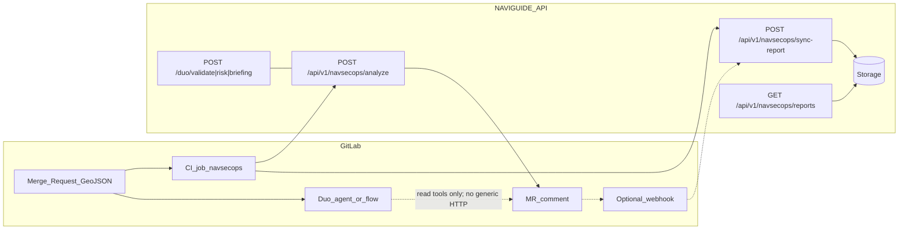

# NAVIGUIDE — NavSecOps (Route-as-Code) Technical Roadmap

**Audience:** engineers working on NAVIGUIDE API, GitLab integration, and hackathon submission.  
**Last updated:** 2026-03-22 (Phase 1 merged).

---

## 1. Purpose

NavSecOps brings **maritime route intelligence** into the **GitLab merge-request workflow**: when route GeoJSON changes, the team gets a **structured analysis** (validation + risk + skipper briefing) without three round-trips to the API. The product stance is **decision support**, not automated merge blocking.

---

## 2. Architecture (target end state)

**Note:** For demos, `proxy_server.py` does **not** currently proxy `/duo/*` or `/api/v1/navsecops/*` to the API; add explicit proxy routes if testing through the unified proxy binary.

---

## 3. Repository baseline (technical anchor)

| Area | Location / notes |
|------|-------------------|
| **Multi-LLM (legacy three-step API)** | `naviguide-api/naviguide_duo.py`: `POST /duo/validate`, `/duo/risk` (Gemini via `naviguide_workspace/llm_utils.py`), `POST /duo/briefing` (Claude). |
| **Single-pass NavSecOps (Phase 1)** | `naviguide-api/naviguide_navsecops_pipeline.py`: `POST /api/v1/navsecops/analyze`. Auth: `naviguide-api/naviguide_navsecops_auth.py` (`NAVSECOPS_INGEST_SECRET`). |
| **FastAPI entry** | `naviguide-api/main.py` — includes `duo_router` and `navsecops_router`. |
| **LLM helpers** | `naviguide_workspace/llm_utils.py` — same `sys.path` pattern as `naviguide_duo.py` for imports from `naviguide-api`. |
| **Duo catalog (hackathon)** | `agents/agent.yml`, `flows/flow.yml` — `read_file` / `read_files` only today. |
| **Proxy** | `proxy_server.py` — extend for `/duo/{path}` and `/api/v1/navsecops/{path}` when needed (Phase 4). |
| **Docs** | `docs/NAVSECOPS_PR_MATRIX.md` — API contract, curl, errors (updated in Phase 1). |

---

## 4. Locked product & platform decisions (Phase 0)

### Decision 1 — Hybrid: CI bridge + Duo agent/flow

- **Why:** The hackathon MCP catalog (e.g. Linear, Atlassian, Context7) does **not** provide a generic authenticated HTTP client to our API. A custom agent limited to **read_file / read_files** cannot reliably `POST` to NavSecOps.
- **Therefore:** **GitLab CI** (`curl` or shell + masked variables) calls `POST /api/v1/navsecops/analyze`, posts the **MR note** via GitLab API, and optionally calls **sync** (Phase 3).
- **Duo’s role:** Publish a **custom agent or flow** in the hackathon group with MR-oriented triggers and read tools—context, narrative, pointing at or summarizing the **CI-generated** report—not replacing the HTTP call.
- **One-liner:** *The Duo agent does not replace the HTTP call to NAVIGUIDE; CI performs the API call and MR comment; Duo provides trigger, context, and the “agent on GitLab” experience.*

### Decision 2 — Host the hackathon API on GCP

- Deploy NavSecOps API (and related demo services) on **Google Cloud Platform** with **GitLab CI → GCP** (build/push/deploy) and secrets in **Secret Manager** and/or masked GitLab CI variables—**never** in the repo.
- `naviguide.fr` may still be used for **DNS/front** (e.g. `api.naviguide.fr` → Cloud Run/LB) as long as the URL is **public HTTPS** and reachable from **GitLab.com shared runners**.
- **One-liner:** *The hackathon NavSecOps API is built and run on GCP with GitLab-driven deployment and proper secret handling.*

### Decision 3 — Inform, do not gate on LLM judgment

- Merge requests may be **merged** even when the report is “red” or unfavorable; **operational authority** stays with humans (skipper at sea, expedition lead ashore—product narrative). GitLab cannot encode “captain at sea”; MVP uses **process + documentation**, not mandatory waiver labels.
- The NavSecOps CI job MUST **fail only on technical errors** (API unreachable, auth failure, invalid payload, non-parseable response, missing secrets). It MUST **not** fail on semantic risk level or briefing tone.
- **One-liner:** *NavSecOps surfaces analysis on the MR; CI enforces technical health only; humans decide whether to merge or sail.*

---

## 5. Phases — specification & status

### Phase 0 — Framing ✅ DONE

Documented decisions above. No code deliverable.

---

### Phase 1 — Single-pass `POST /api/v1/navsecops/analyze` ✅ DELIVERED (MR !3)

**Goal:** One HTTP call returns a full report: validate (Gemini) → risk (Gemini) → briefing (Claude), **server-side**.

**Implemented:**
- `POST /api/v1/navsecops/analyze`  
  Body: `{ "geojson": { ... }, "language": "fr" | "en" }` (same conceptual shape as `GeoJSONRequest` in `naviguide_duo.py`).
- Response contract: `status`: `complete` | `partial` | `failed`; `validation`, `risk`, `briefing` (nullable); `errors[]` per stage; `meta` (e.g. `request_id`, `duration_ms`, models).
- **Rules:** Validate failure → `failed`, skip downstream. Risk failure → skip briefing, `partial`. Briefing missing (e.g. no Anthropic key) → `partial` with error detail.
- **Auth:** `Authorization: Bearer <NAVSECOPS_INGEST_SECRET>` — 401 on mismatch; **500 if secret not configured server-side** (documented).
- **Logging:** One structured JSON log line per request (event, request_id, status, duration, stages ok/failed).
- **Docs / examples:** `docs/NAVSECOPS_PR_MATRIX.md` + `naviguide-api/.env.example` (`NAVSECOPS_INGEST_SECRET`, etc.).
- **Hygiene:** Removed tracked `.env.txt`; `.gitignore` includes `.env.txt` and `naviguide-api/var/` (for future SQLite).

**Acceptance (local example, port may vary):**
- Valid Bearer + body → **200**, `status: complete` (when LLMs configured).
- Wrong Bearer → **401**.
- Invalid body → **422**.
- Unset `ANTHROPIC_API_KEY` → **200** with `status: partial`, `briefing: null`, non-empty `errors` (verify against live contract).

**Explicitly out of scope for Phase 1:** storage, sync, `.gitlab-ci.yml`, webhooks.

---

### Phase 2 — GitLab-side trigger (MR + GeoJSON)

**Goal:** On MRs that touch route files, post an **Intelligence Report** on the MR.

#### Phase 2A — GitLab CI (primary / reliable) 🔜 NEXT

| Item | Detail |
|------|--------|
| **Where** | Root `.gitlab-ci.yml`; optional `scripts/gitlab_mr_navsecops.sh`. |
| **When** | `merge_request_pipeline` / `merge_request_event`; `rules:changes` on e.g. `routes/**/*.geojson`, `data/**/*.geojson`. |
| **Steps** | Resolve target GeoJSON (**convention** + optional `NAVSECOPS_ROUTE_FILE` CI variable—avoid blind `head -1` on diff); build JSON body with **`jq`** (never shell-concatenate raw GeoJSON into JSON). |
| **Call** | `curl --max-time 90` (or higher) to `NAVSECOPS_BASE_URL/api/v1/navsecops/analyze` with Bearer. |
| **Technical success** | Treat **non-2xx** as job failure (include **422**). Do **not** fail on `status: partial` in a **200** response (Decision 3). |
| **MR note** | GitLab API `POST .../merge_requests/:iid/notes` with markdown + optional `
` raw JSON. |
| **Observability** | `artifacts: when: always` with `navsecops-response.json` and timing metadata. |
| **Secrets (CI)** | `NAVSECOPS_BASE_URL`, `NAVSECOPS_INGEST_SECRET`, `GITLAB_TOKEN` or appropriately scoped token for notes—masked/protected. |

#### Phase 2B — Duo agent / flow (stretch)

- Update `agents/agent.yml` / `flows/flow.yml`: summarize route from read tools; **do not** assume a catalog HTTP tool to NAVIGUIDE; complement CI report.
- Deliverable: demo MR showing agent comment **in addition to** CI.

---

### Phase 3 — Persist reports (sync + storage) 🔜

**Goal:** Store structured history for app / auditors.

**MVP recommendation:** **Final step of Phase 2A CI** calls `POST /api/v1/navsecops/sync-report` (skip GitLab **webhook** for hackathon MVP—easier to debug).

**API:**
- `POST /api/v1/navsecops/sync-report` — payload: `project_id`, `merge_request_iid`, `source_commit_sha`, route key / file path, `report_markdown`, optional `raw_analysis` (mind **payload size** vs shell `jq`).
- Auth: same Bearer (or aligned secret).

**Storage:**
- MVP: **SQLite** under `naviguide-api/var/` (gitignored). **Cloud Run caveat:** filesystem is **ephemeral**—acceptable for short demo windows; use **Cloud SQL** or **GCS** for durable production.

**Idempotency:** Unique key on `(project_id, merge_request_iid, commit_sha)` — upsert or skip on retry.

**Read API (minimal):** `GET /api/v1/navsecops/reports` and/or `GET .../reports/{id}`.

---

### Phase 4 — Proxy + UI (stretch for hackathon)

- **Proxy:** `proxy_server.py` — proxy `/duo/{path:path}` and `/api/v1/navsecops/{path:path}` to `API_BACKEND` before static catch-all.
- **UI:** Tab/panel calling `GET .../reports` with **sanitized** markdown rendering; if SPA lives elsewhere, document contract in `docs/` (e.g. `NAVSECOPS_UI.md`).

---

### Phase 5 — Quality, security, demo hardening 🔜

- Grep / policy: no committed `ANTHROPIC_API_KEY`, `GEMINI_API_KEY`, `NAVSECOPS_INGEST_SECRET`, `glpat-`.
- Unit tests: payload parsing, auth dependency, mocked LLM stages.
- Manual integration: sample MR + screenshot / recording for judges.
- Traceability: MR comment includes `merge_request_iid`, commit SHA, pipeline link.
- Legacy cleanup: `nova` / `bedrock` references (per team policy).

---

## 6. Recommended execution order

1. Phase 0 ✅  
2. Phase 1 ✅  
3. **Phase 2A** (CI + MR comment) — fastest path to end-to-end demo.  
4. Phase 3 (sync from CI + SQLite + GET).  
5. Phase 4 (proxy + UI or docs-only contract).  
6. Phase 2B (Duo enrichment) if time / catalog allows.  
7. Phase 5 (hardening + submission assets).

---

## 7. References

- GitLab MR Notes API: https://docs.gitlab.com/ee/api/merge_request_notes.html  
- GitLab ↔ Google Cloud: https://docs.gitlab.com/ci/gitlab_google_cloud_integration/  
- Hackathon context: https://gitlab.devpost.com/ (rules, resources, updates)

---

## 8. Changelog snippet

| Date | Milestone |
|------|-----------|
| 2026-03-22 | Phase 1 merged (MR !3): `/api/v1/navsecops/analyze`, auth module, docs, `.env` hygiene. |
