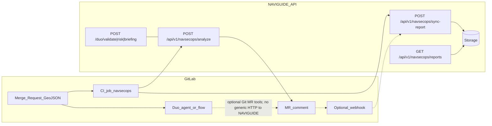

# NAVIGUIDE — NavSecOps (Route-as-Code) Technical Roadmap

**Audience:** engineers working on NAVIGUIDE API, GitLab integration, and hackathon submission.  
**Last updated:** 2026-03-24 (Duo: captain short messages + MR-only Git path + reviewers).

---

## 1. Purpose

NavSecOps brings **maritime route intelligence** into the **GitLab merge-request workflow**: when route GeoJSON changes, the team gets a **structured analysis** (validation + risk + skipper briefing) without three round-trips to the API. The product stance is **decision support**, not automated merge blocking.

---

## 2. Architecture (target end state)

**Note:** `proxy_server.py` proxies `/api/v1/navsecops/*` and `/duo/*` to `API_BACKEND` (naviguide-api) **before** the `/api/v1/*` orchestrator catch-all (Phase 4).

---

## 3. Repository baseline (technical anchor)

| Area | Location / notes |
|------|-------------------|
| **Multi-LLM (legacy three-step API)** | `naviguide-api/naviguide_duo.py`: `POST /duo/validate`, `/duo/risk` (Gemini via `naviguide_workspace/llm_utils.py`), `POST /duo/briefing` (Claude). |
| **Single-pass NavSecOps (Phase 1)** | `naviguide-api/naviguide_navsecops_pipeline.py`: `POST /api/v1/navsecops/analyze`. Auth: `naviguide-api/naviguide_navsecops_auth.py` (`NAVSECOPS_INGEST_SECRET`). |
| **NavSecOps persistence (Phase 3)** | `naviguide-api/naviguide_navsecops_store.py` (SQLite), `naviguide-api/naviguide_navsecops_sync.py`: `POST /sync-report`, `GET /reports`, `GET /reports/{id}`. |
| **FastAPI entry** | `naviguide-api/main.py` — includes `duo_router`, `navsecops_router`, `navsecops_sync_router` under `/api/v1/navsecops`. |
| **LLM helpers** | `naviguide_workspace/llm_utils.py` — same `sys.path` pattern as `naviguide_duo.py` for imports from `naviguide-api`. |
| **Duo catalog (hackathon)** | `agents/agent.yml`, `flows/flow.yml` — pasted GeoJSON vs `main`, **captain short-message** mode (no massive paste), **MR-only** Git workflow: branch `create_commit` → `create_merge_request` → mandatory `create_merge_request_note` → `update_merge_request` reviewers `iamRabia_N` + `clementfilisetti` (see §9, §9.6). No `POST /api/v1/navsecops/analyze` from Duo; CI + PDF/`curl` guide unchanged. |
| **Proxy** | `proxy_server.py` — `/api/v1/navsecops/*` and `/duo/*` → `API_BACKEND` before orchestrator (Phase 4). |
| **Docs** | `docs/NAVSECOPS_PR_MATRIX.md` — API contract, curl, errors (Phases 1, 3, 4). |

---

## 4. Locked product & platform decisions (Phase 0)

### Decision 1 — Hybrid: CI bridge + Duo agent/flow

- **Why:** The hackathon MCP catalog (e.g. Linear, Atlassian, Context7) does **not** provide a generic authenticated HTTP client to our API. A custom agent limited to **read_file / read_files** cannot reliably `POST` to NavSecOps.
- **Therefore:** **GitLab CI** (`curl` or shell + masked variables) calls `POST /api/v1/navsecops/analyze`, posts the **MR note** via GitLab API, and optionally calls **sync** (Phase 3).
- **Duo’s role:** Custom agent/flow with **pasted vs `main`** compare, **short captain instructions** (load canon via `get_repository_file`, clarifications, avant/après), and **MR-only** repo updates after explicit confirmation: **never commit to `main` directly**; minimal edit to `routes/naviguide-berry-mappemonde.geojson` on a **feature branch**, MR to `main`, **mandatory** MR note (briefing), reviewers **`iamRabia_N`** and **`clementfilisetti`**. Duo does **not** call NAVIGUIDE over HTTP; **CI + PDF/local guide** stay primary for `analyze` and pipeline MR notes.
- **One-liner:** *The Duo agent does not replace the HTTP call to NAVIGUIDE; CI performs the API call and MR comment; Duo provides trigger, context, and the “agent on GitLab” experience.*

### Decision 2 — Host the hackathon API on GCP

- Deploy NavSecOps API (and related demo services) on **Google Cloud Platform** with **GitLab CI → GCP** (build/push/deploy) and secrets in **Secret Manager** and/or masked GitLab CI variables—**never** in the repo.
- `naviguide.fr` may still be used for **DNS/front** (e.g. `api.naviguide.fr` → Cloud Run/LB) as long as the URL is **public HTTPS** and reachable from **GitLab.com shared runners**.
- **One-liner:** *The hackathon NavSecOps API is built and run on GCP with GitLab-driven deployment and proper secret handling.*

### Decision 3 — Inform, do not gate on LLM judgment

- Merge requests may be **merged** even when the report is “red” or unfavorable; **operational authority** stays with humans (skipper at sea, expedition lead ashore—product narrative). GitLab cannot encode “captain at sea”; MVP uses **process + documentation**, not mandatory waiver labels.
- The NavSecOps CI job MUST **fail only on technical errors** (API unreachable, auth failure, invalid payload, non-parseable response, missing secrets). It MUST **not** fail on semantic risk level or briefing tone.
- **One-liner:** *NavSecOps surfaces analysis on the MR; CI enforces technical health only; humans decide whether to merge or sail.*

---

## 5. Phases — specification & status

### Phase 0 — Framing ✅ DONE

Documented decisions above. No code deliverable.

---

### Phase 1 — Single-pass `POST /api/v1/navsecops/analyze` ✅ DELIVERED (MR !3)

**Goal:** One HTTP call returns a full report: validate (Gemini) → risk (Gemini) → briefing (Claude), **server-side**.

**Implemented:**
- `POST /api/v1/navsecops/analyze`  
  Body: `{ "geojson": { ... }, "language": "fr" | "en" }` (same conceptual shape as `GeoJSONRequest` in `naviguide_duo.py`).
- Response contract: `status`: `complete` | `partial` | `failed`; `validation`, `risk`, `briefing` (nullable); `errors[]` per stage; `meta` (e.g. `request_id`, `duration_ms`, models).
- **Rules:** Validate failure → `failed`, skip downstream. Risk failure → skip briefing, `partial`. Briefing missing (e.g. no Anthropic key) → `partial` with error detail.
- **Auth:** `Authorization: Bearer <NAVSECOPS_INGEST_SECRET>` — 401 on mismatch; **500 if secret not configured server-side** (documented).
- **Logging:** One structured JSON log line per request (event, request_id, status, duration, stages ok/failed).
- **Docs / examples:** `docs/NAVSECOPS_PR_MATRIX.md` + `naviguide-api/.env.example` (`NAVSECOPS_INGEST_SECRET`, etc.).
- **Hygiene:** Removed tracked `.env.txt`; `.gitignore` includes `.env.txt` and `naviguide-api/var/` (for future SQLite).

**Acceptance (local example, port may vary):**
- Valid Bearer + body → **200**, `status: complete` (when LLMs configured).
- Wrong Bearer → **401**.
- Invalid body → **422**.
- Unset `ANTHROPIC_API_KEY` → **200** with `status: partial`, `briefing: null`, non-empty `errors` (verify against live contract).

**Explicitly out of scope for Phase 1:** storage, sync, `.gitlab-ci.yml`, webhooks.

---

### Phase 2 — GitLab-side trigger (MR + GeoJSON)

**Goal:** On MRs that touch route files, post an **Intelligence Report** on the MR.

#### Phase 2A — GitLab CI (primary / reliable) ✅ DELIVERED

| Item | Detail |
|------|--------|
| **Where** | Root `.gitlab-ci.yml`; `scripts/gitlab_mr_navsecops.sh`. |
| **When** | `merge_request_pipeline` / `merge_request_event` (see `.gitlab-ci.yml` rules). |
| **Steps** | Resolve target GeoJSON (**convention** + optional `NAVSECOPS_ROUTE_FILE` CI variable); build JSON body with **`jq`**. |
| **Call** | `curl --max-time 120` to `NAVSECOPS_BASE_URL/api/v1/navsecops/analyze` with Bearer. |
| **Technical success** | Treat **non-2xx** as job failure (include **422**). Do **not** fail on `status: partial` in a **200** response (Decision 3). |
| **MR note** | GitLab API `POST .../merge_requests/:iid/notes` with markdown + optional `
` raw JSON. |
| **Observability** | `artifacts: when: always` with `navsecops-response.json`, `navsecops-timing.json`, `navsecops-sync-response.json`. |
| **Secrets (CI)** | `NAVSECOPS_BASE_URL`, `NAVSECOPS_INGEST_SECRET`, `GITLAB_TOKEN` or `CI_JOB_TOKEN` for notes—masked/protected. |
| **Optional sync (Phase 3)** | Set `NAVSECOPS_SYNC_ENABLED=1` to POST `sync-report` after the note; failures fail the job when enabled. |

#### Phase 2B — Duo agent / flow ✅ ENRICHED (2026-03-24)

- **`agents/agent.yml` / `flows/flow.yml`:** (1) **Pasted** GeoJSON → `get_repository_file` (`main`, `routes/naviguide-berry-mappemonde.geojson`) → semantic compare → `## Écart par rapport au tracé canonique (main)` + four rubriques si diff. (2) **Captain short message** (pas de gros JSON) → même canon → consigne en langage naturel → `## Consigne comprise` / extraits canon / `## Proposition (après)` / questions si besoin → rubriques skipper. (3) **Standard** fichier/MR/`list_dir`. **No** catalog HTTP to NAVIGUIDE.
- **Git path (MR-only, after explicit confirmation):** `create_commit` **only** on `feat/route-*` or `duo/*`; **minimal** diff sur `routes/naviguide-berry-mappemonde.geojson` (reprendre le JSON canon en entier, ne modifier que les `features` concernées — pas de régénération complète) → `create_merge_request` → **`create_merge_request_note` obligatoire** (briefing) → `update_merge_request` reviewers **`iamRabia_N`**, **`clementfilisetti`**. **Interdit:** commit/push sur `main` sans MR.
- **Tool names** are `snake_case` per [GitLab Agent tools](https://docs.gitlab.com/development/duo_agent_platform/agents/tools/) — re-validate before each catalog publish; **Web vs IDE** availability may differ.
- Deliverable: Duo complements **CI**; job **`navsecops_mr`** sur MR qui touche `.geojson` inchangé.

---

### Phase 3 — Persist reports (sync + storage) ✅ DELIVERED (2026-03-23)

**Goal:** Store structured history for app / auditors.

**Implemented:**
- **SQLite** at `naviguide-api/var/navsecops.db` via `naviguide_navsecops_store.py` (`init_db`, `upsert_report`, `list_reports`, `get_report_by_id`).
- `POST /api/v1/navsecops/sync-report` — Pydantic body; same Bearer as `analyze`; upsert on `(project_id, merge_request_iid, source_commit_sha)`.
- `GET /api/v1/navsecops/reports` — paginated list (`project_id`, `limit`, `offset` query params); responses contain **no secrets**.
- `GET /api/v1/navsecops/reports/{report_id}` — single row including parsed `raw_analysis` when stored.
- **CI (optional):** `NAVSECOPS_SYNC_ENABLED=1` in `scripts/gitlab_mr_navsecops.sh` after MR note; non-2xx fails the job when enabled.
- **Docs:** `docs/NAVSECOPS_PR_MATRIX.md` Phase 3 section.

**Cloud Run caveat:** ephemeral disk — same as matrix; production = Cloud SQL / GCS / etc.

---

### Phase 4 — Proxy (+ UI stretch) — proxy ✅ DELIVERED (2026-03-23)

- **Proxy:** `proxy_server.py` routes `/api/v1/navsecops/{path:path}` and `/duo/{path:path}` to `API_BACKEND` **before** the orchestrator `/api/v1/{path}` catch-all; polar and routing prefixes unchanged.
- **UI:** Not implemented; contract for `GET /reports` remains in `NAVSECOPS_PR_MATRIX.md` for a future panel or external SPA.

---

### Phase 5 — Quality, security, demo hardening 🔜

- Grep / policy: no committed `ANTHROPIC_API_KEY`, `GEMINI_API_KEY`, `NAVSECOPS_INGEST_SECRET`, `glpat-`.
- Unit tests: payload parsing, auth dependency, mocked LLM stages.
- Manual integration: sample MR + screenshot / recording for judges.
- Traceability: MR comment includes `merge_request_iid`, commit SHA, pipeline link.
- Legacy cleanup: `nova` / `bedrock` references (per team policy).

---

## 6. Recommended execution order

1. Phase 0 ✅  
2. Phase 1 ✅  
3. Phase 2A ✅ (CI + MR comment)  
4. Phase 3 ✅ (sync from CI optional + SQLite + GET)  
5. Phase 4 ✅ (proxy); UI still optional  
6. Phase 2B (Duo enrichment) ✅ catalog YAML updated; republication + tests per §9.  
7. Phase 5 (hardening + submission assets).

---

## 7. References

- GitLab MR Notes API: https://docs.gitlab.com/ee/api/merge_request_notes.html  
- GitLab ↔ Google Cloud: https://docs.gitlab.com/ci/gitlab_google_cloud_integration/  
- Hackathon context: https://gitlab.devpost.com/ (rules, resources, updates)

---

## 8. Changelog snippet

| Date | Milestone |
|------|-----------|
| 2026-03-22 | Phase 1 merged (MR !3): `/api/v1/navsecops/analyze`, auth module, docs, `.env` hygiene. |
| 2026-03-23 | Phase 3: SQLite store, `sync-report`, `GET /reports`, optional `NAVSECOPS_SYNC_ENABLED` CI. Phase 4: `proxy_server.py` routes for `/api/v1/navsecops/*` and `/duo/*`. |
| 2026-03-24 | Phase 2B: Duo YAML — pasted GeoJSON vs `main`, skipper comparative format, optional `create_commit` / MR / reviewers / note tools; tag `backup/flow-yaml-avant-toolset` + roadmap §9 (Duo catalog). |
| 2026-03-24 | Phase 2B+: Captain short-message mode, MR-only Git (no `main` direct), mandatory MR briefing note, reviewers `iamRabia_N` + `clementfilisetti`, minimal GeoJSON edits; §9.6. |

---

## 9. Duo catalog — rollback, republication, Plan B

### 9.1 Backup before risky YAML changes

- **Git tag (pre–write-toolset baseline):** `backup/flow-yaml-avant-toolset` at commit `62a4fb8e785a14f77fadb4c285e7072c0b04fd35`.
- **Catalog definition hashes before next GitLab sync** (from `.ai-catalog-mapping.json`): agent `791a62d6953b0cc5`, flow `073663312359001e`.
- **Rollback:** `git checkout backup/flow-yaml-avant-toolset -- flows/flow.yml agents/agent.yml` (or revert the bump commit), republish the Duo catalog entry to match, and record the restored commit hash.

### 9.2 Republication checklist (hackathon)

1. Merge or push YAML changes on the canonical branch.
2. Create a **new git tag** for catalog sync if the hackathon requires it (e.g. bump `navsecops-catalog-berry-mappemonde-2026-v2` → `navsecops-catalog-berry-mappemonde-2026-v3` after captain-mode prompt changes).
3. Run **agent/flow validation** in GitLab CI if enabled for the project.
4. Publish/sync the **agent** and **flow** catalog items in the Duo UI.
5. Update `.ai-catalog-mapping.json` with new `definition_hash` / `synced_at` / `git_tag` after GitLab returns post-sync metadata.

### 9.3 Manual verification (post-publish)

- Paste GeoJSON **identical** to `main` → short confirmation, no unsolicited MR/commit.
- Paste **different** GeoJSON → comparative briefing, no meta-hackathon wording.
- **Captain phrase** (e.g. SPM after Nouméa) → `get_repository_file`; avant/après + noms fichier; clarifications if ambiguous; **no** Git until explicit confirmation of parcours.
- After **explicit** “yes” to repo integration → branch commit (not `main`) → MR → **MR note** with briefing → reviewers `iamRabia_N` + `clementfilisetti` (or manual assign).
- **Non-regression:** open MR touching `.geojson` → `navsecops_mr` still runs and posts the API-driven note as before.

### 9.4 Plan B (permissions / API limits)

- **`update_merge_request` cannot set reviewers:** finish with MR link; assign Rabia and Clément manually (or use a PAT + GitLab API outside Duo — do not change `scripts/gitlab_mr_navsecops.sh` for this).
- **`create_commit` denied** (push rules, protected branches, missing IDE/Web tool): reply with unified diff or full GeoJSON + instructions to branch/MR manually.
- **`create_merge_request_note` blocked:** paste briefing into MR description or a manual note (same fallback as the PDF guide).

### 9.5 Reviewers parameterization

- Default reviewers in YAML: **`iamRabia_N`**, **`clementfilisetti`**. On a fork with different handles, adjust prompts or assign manually (Plan B).

### 9.6 Captain mode vs paste — MR-only summary

| Mode | Trigger | Git |
|------|---------|-----|
| **Paste** | Large GeoJSON in message | Compare to `main`; MR tools only after explicit confirm; MR-only policy applies. |
| **Captain** | Short operational instruction, no big JSON | Load canon; clarifications; readable proposal; confirm parcours → same MR-only chain. |

**Minimal GeoJSON edit:** start from full canonical `get_repository_file` output; change only affected `features`; never rewrite the whole FeatureCollection from scratch in the model. **CI:** MR with `.geojson` diff still triggers **`navsecops_mr`** (`.gitlab-ci.yml` unchanged).
